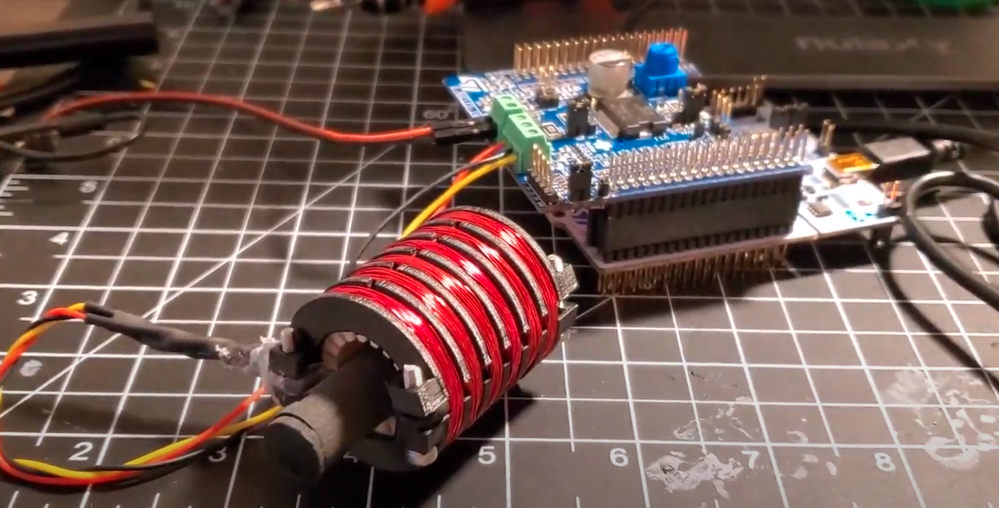
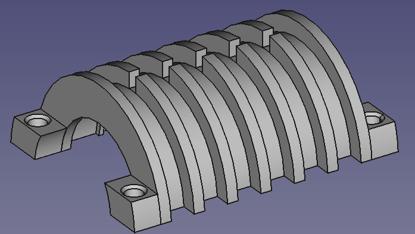
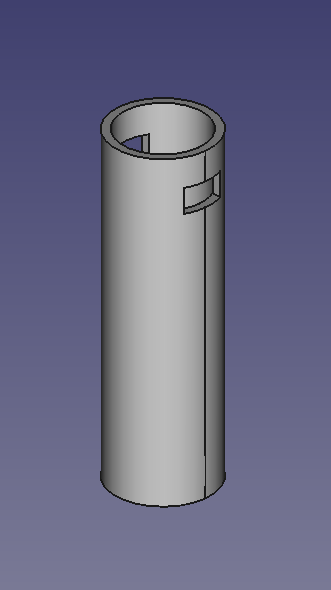
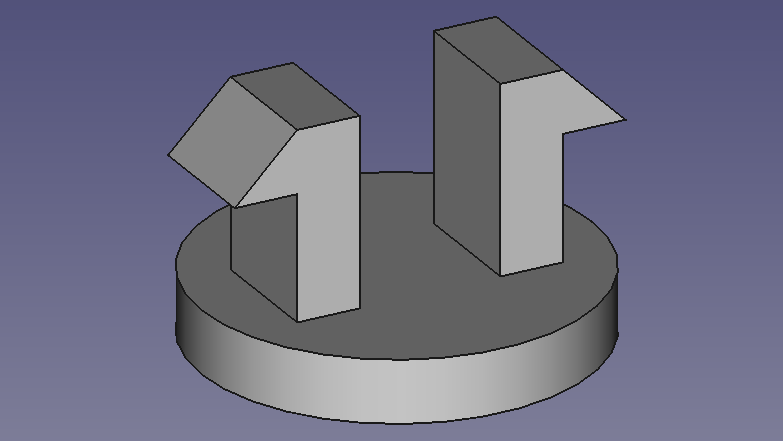
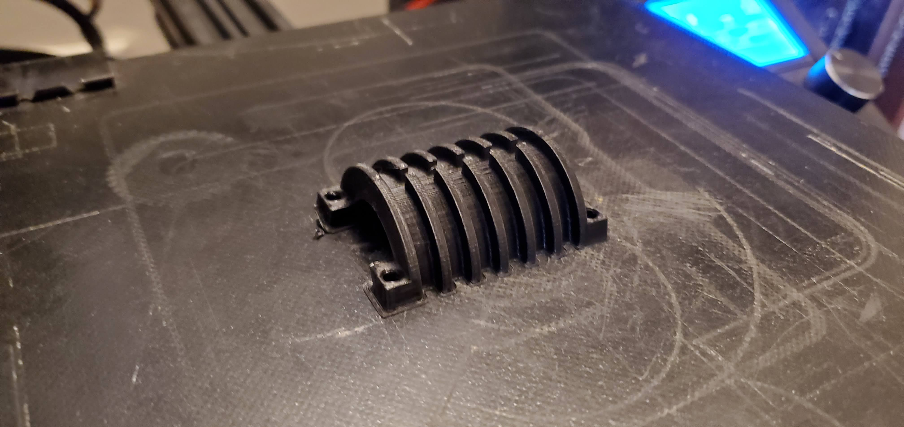
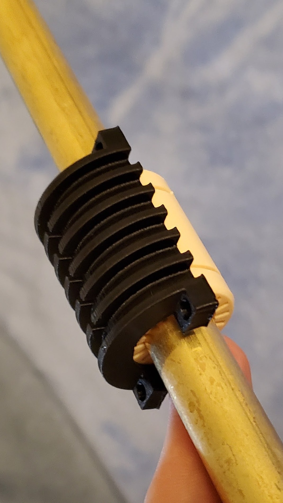
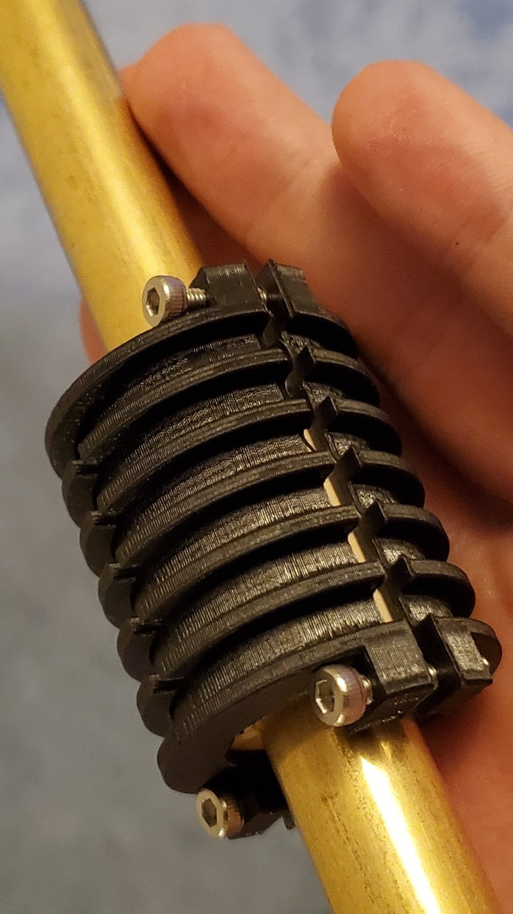
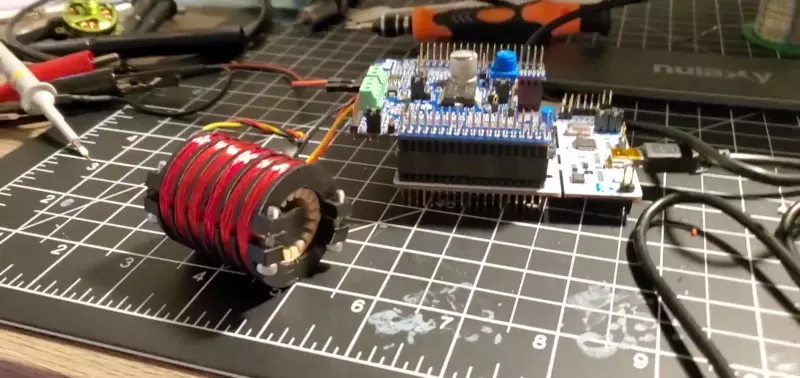

# Axial Linear Motor
A 3D printed linear motor prototype

# Background
While the end-goal of many actuators is linear motion, achieving linear motion usually involves a rotary motor and a ball-screw or a spool and cable assembly. While both of those options will suffice for most applications, they significantly increase the complexity of most assemblies and are susceptible to wear. There do exist linear motors, but most designs have the coil-magnet flux normal to the path of travel, essentially forming a rotary BLDC motor with an infinite radius. This configuration reduces the efficiency and the force output for a motor of a given size. 

While it is even possible to purchase linear motors where the flux angle is always perfectly aligned (what I'll call "Axial Flux Linear Motors") they're often prohibitively expensive outside of commercial applications and lack potential for customization. The goal for this project is to design a functional, scalable prototype of an axial linear motor that can be re-used in future designs.

# Design
The current iteration of this design is as follows:
- A metal (brass) tube (16mm OD) that will serve as the rail (or piston) for the actuator
- A 3D printed tube to fit inside the rail that will conwtain the magnets
- A polymer linear bearing (Igus 16mm ID) for ease of movement between the carriage and rail
- A carriage formed of two shells that clamp around the bearing
- Three phases of magnet wire that wind around the carriage assembly

Renderings and images of the parts can be seen below:

Carriage half body

Magnet housing tube body

Magnet housing cap

# Assembly
The assembly of the 3D printed carriage body is relatively straight-forward: snap the two halves around the bearing and insert 4x M3 screws to hold it together. 

## Carriage
The more difficult portion lies in the winding of the coils. While this would definitely benefit from a video, my best at describing the process is here:

1. For the first phase (A), feed the wire between the halves of the outer body and wrap one end of magnet wire around one of the clamping screws 
2. Wind the coil for as many turns as intended, choosing either clockwise or counter-clockwise *NOTE: All coils must be wound in the same direction*
3. Run the wire through the cut at the top or bottom, skipping 2 rows before bending into the channel- make sure it's in a stable position
4. Feed end of the second phase (B) between the two halves of the outer body and under the first phase, wrap around the same screw to secure
5. Begin winding the coil, ensuring that the wire from the first phase is clamped firmly under this new coil
6. When done winding, repeat step 2
7. Follow step 3, feeding the wire for phase C under both existing phases
8. Wind the coil, then run to the final open channel
9. Pull on phase A to tighten it in the first coil, then wrap the second
10. When done winding, unroll an addional length of wire approximately the length of the carriage and cut the wire from the spool
11. Run this end between the halves of the outer body and under all the coils
12. When through, pull tight to secure the second coil of phase A, then wrap carefully around the clamping screw on this end. Label this wire.
13. Repeat steps 9-12 for phases B and 
14. Tin the ends of the wires and test for phase to phase shorts
15. Twist together and solder the starting ends of the 3 phases
16. Tin, solder, and heatshrink the opposite ends for the 3 phases (I recommend color coding and, as kludgy as it feels, hot glue makes a great strain relief to avoid phase to phase shorts.
 
In the version that can be seen in the video, each coil contains 75 turns of 28AWG wire.
 
## Rail
This part, while conceptually much simpler, is a massive pain. In order to get magnetic "teeth" that the coils can hold on to, the magnets must be put together in an opposition to eachother (i.e. SN-NS-SN-NS...). This can be illustrated with some magnetic viewing film:

When aligned naturally, the poles of the magnets "short-out" and essentially form one large magnet

But when they're put together in opposition, they become seperable, allowing for the coils to hold the rail/piston in place.

To make the rail, fill the Magnet Housing with as many magnets in opposition as possible, then close the cap (you'll likely want to add glue to ensure it doesn't open, but avoid forming lumps that will catch on the carriage bearing).

The small piston seen in the video only has 4 magnets in it.

# Controls
This one certainly has room for improvement. I'm currently driving it with an X-NUCLEO-IHM07M1 kit and a basic 6-Step commutation. The current iteration of the design does not generate sufficient back-emf on movement, so some sort of encoder will be necessary (or a change to the coil setup, which is more likely)

# Conclusion
The current iteration with coils made from 75 turns of 28AWG wire and a 4 magnet piston can oscillate at up to ~3Hz when run at ~18V, ~1.2A. Exciting for a second iteration (first iteration was 9 turns of 2 24AWG strands: needed way too much current), but definitely a lot of room for improvement to be anything more than a desk toy.

# Room for improvement
Theres a lot here that will need exploration:
- A greater quantity of shorter phases
- More turns of thinner wire
- Stabilized magnets within the rail

